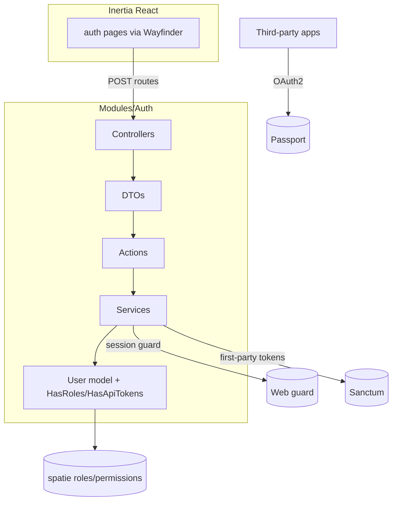
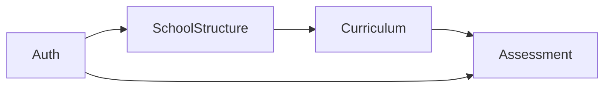

# Requirements

### Overview & Goals
Build a self-contained **Auth module** (`Modules/Auth`) using `nwidart/laravel-modules`, following the project's Action / DTO / Service pattern. It provides authentication (register, login, logout), password reset, email verification, and a full **roles & permissions** system (users may hold multiple roles; each role carries delegated permissions). Auth is the first module of a modular Kenyan CBC/CBE platform.

This establishes the modular foundation and conventions all later modules (SchoolStructure, Curriculum, Assessment) will follow.

### Scope

**In Scope**
- New `Modules/Auth` module scaffolded via `php artisan module:make Auth`.
- Move `User` model + users migration into the Auth module (self-contained).
- Register / Login / Logout (session-based for the Inertia web SPA).
- Forgot-password + reset-password flows (token via email).
- Email verification flow.
- Roles & permissions via **spatie/laravel-permission** (many-to-many users↔roles↔permissions), with seeded CBE roles: `admin`, `teacher`, `student`, `parent`.
- **Sanctum** for first-party token auth (Android/desktop) and **Passport** OAuth2 authorization-code server for third-party apps.
- Full-stack Inertia React auth pages wired via Wayfinder.
- Feature + unit tests for the module.

**Out of Scope**
- The SchoolStructure, Curriculum, and Assessment modules (roadmap only — see Module Roadmap tab).
- Social/OAuth *login* providers (Google, etc.).
- Multi-factor authentication.

### User Stories
- As a **visitor**, I can register with name/email/password so I can access the system.
- As a **user**, I can log in and log out securely.
- As a **user**, I can reset a forgotten password via an emailed link.
- As a **user**, I must verify my email before accessing protected areas.
- As an **admin**, users can hold multiple roles and each role grants a set of permissions that gate access.
- As a **third-party app developer**, I can obtain OAuth2 access to the platform via Passport.
- As a **mobile/desktop client**, I can authenticate with a first-party Sanctum token.

### Functional Requirements
- Registration validates unique email + confirmed password, hashes the password, fires `Registered` event, and issues an email-verification notification.
- Login authenticates against the session guard, regenerates the session, and rejects invalid credentials with validation errors.
- Password reset uses Laravel's `Password` broker with tokened email links.
- Email verification uses signed URLs; unverified users are redirected/blocked by the `verified` middleware.
- Roles/permissions enforced via spatie middleware and policies/gates.
- API guards: `sanctum` for first-party tokens, `api` (Passport) for OAuth2 third-party access.

### Non-Functional Requirements
- Passwords hashed with bcrypt/argon (Laravel default), routes rate-limited.
- Module must be independently enable/disable-able and follow existing code style (Pint, PHPStan, `declare(strict_types=1)`, final classes, typed signatures).

# Technical Design

### Current Implementation
- Blank Laravel 13 + Inertia React starter. `nwidart/laravel-modules` v13 installed; `composer.json` merge-plugin already wired for `Modules/*/composer.json`. No `Modules/` directory yet.
- `app/Models/User.php` is a bare `Authenticatable` (attribute-based `#[Fillable]`/`#[Hidden]`, `casts()` with hashed password). No auth controllers/routes/pages exist. `routes/web.php` only serves `welcome`.
- `config/modules.php` generator: `controller`, `provider`, `route-provider`, `config`, `migration`, `seeder`, `routes`, tests are `generate=true`; `actions`, `services`, `request`, `enums`, `interfaces`, `model` are `generate=false` (so Action/DTO/Service folders are created manually inside the module at `app/Actions`, `app/Services`, etc.).
- Frontend uses `resources/js/pages` (lowercase) with Inertia + Wayfinder (`@/actions`, `@/routes`).

### Key Decisions
1. **User model relocated** to `Modules/Auth/app/Models/User` with its migration in `Modules/Auth/database/migrations`; the old `app/Models/User.php` + starter users migration are removed. `config/auth.php` `providers.users.model` points to the module class. (User confirmed.)
2. **spatie/laravel-permission** for roles/permissions (many-to-many, cached, middleware) — requires adding the dependency. (User confirmed.)
3. **Sanctum + Passport**: Sanctum guards first-party web SPA session + mobile/desktop tokens; Passport is the OAuth2 server for third-party apps. (User confirmed.)
4. **Action pattern**: each use-case is a single-purpose invokable Action, receiving a typed DTO, orchestrated by controllers; cross-cutting logic lives in Services.
5. **Frontend location**: auth pages live in the app's `resources/js/pages/auth/*` (matching existing convention) rather than the module's `resources/js/Pages`, since Inertia resolves from the app path.

### Proposed Changes

**Module scaffold** (`php artisan module:make Auth`) then add pattern folders:
```
Modules/Auth/
  app/
    Actions/            # RegisterUserAction, LoginAction, LogoutAction, ...
    DataTransferObjects/ # RegisterUserData, LoginData, ResetPasswordData, ...
    Services/           # AuthService, TokenService
    Enums/              # RoleName, PermissionName
    Models/             # User
    Http/
      Controllers/      # Register/Login/Logout/PasswordReset/EmailVerification/OAuth controllers
      Requests/         # RegisterRequest, LoginRequest, ResetPasswordRequest, ...
      Middleware/       # (spatie role/permission aliases registered in provider)
    Policies/
    Providers/          # AuthServiceProvider, RouteServiceProvider
  config/auth.php (module config)
  database/migrations/ # users, password_reset_tokens, permission tables, oauth tables published here or app
  database/seeders/    # RolesAndPermissionsSeeder
  routes/web.php, routes/api.php
  tests/Feature, tests/Unit
```

**Actions (examples):**
- `RegisterUserAction(RegisterUserData): User`
- `LoginAction(LoginData): void` (attempts session guard)
- `LogoutAction(): void`
- `SendPasswordResetLinkAction(string $email): string`
- `ResetPasswordAction(ResetPasswordData): string`
- `VerifyEmailAction(User $user): void`
- `AssignRolesAction(User $user, array $roles): void`

**Services:**
- `AuthService` — session login/logout, credential checks.
- `TokenService` — issue/revoke Sanctum tokens for first-party mobile/desktop.

### Data Models / Contracts
```php
final class RegisterUserData {
    public function __construct(
        public string $name,
        public string $email,
        public string $password,
    ) {}
    public static function fromRequest(RegisterRequest $request): self { /* ... */ }
}

final class RegisterUserAction {
    public function __construct(private AuthService $auth) {}
    public function handle(RegisterUserData $data): User { /* create, event, verify */ }
}
```
- `User` uses `HasRoles` (spatie), `HasApiTokens` (Sanctum), `MustVerifyEmail`.
- `RoleName` / `PermissionName` PHP enums (TitleCase keys) drive the seeder.

### Components (Frontend)
- `resources/js/pages/auth/login.tsx`, `register.tsx`, `forgot-password.tsx`, `reset-password.tsx`, `verify-email.tsx`.
- A simple `auth-layout` wrapper; forms submit via Wayfinder-generated actions imported from `@/actions`.

### File Structure
- New: `Modules/Auth/**` (as above).
- Modified: `config/auth.php` (guards `sanctum`, `api`=passport; user provider model), `bootstrap/app.php` / module provider (middleware aliases), `composer.json` (spatie, sanctum, passport), `resources/js/pages/auth/**`.
- Removed: `app/Models/User.php`, starter users/password-reset migrations (relocated into module).

### Architecture Diagram


### Risks
- **User model move** touches `config/auth.php`, factories, and any references — must update all and re-run migrations on a fresh DB.
- **Passport + Sanctum coexistence**: keep clear guard separation (`sanctum` for first-party, `api` for OAuth2) to avoid guard conflicts.
- **Migration ownership**: spatie/passport publish migrations to `database/migrations`; decide app vs module location consistently (auto-discovery is enabled for module migrations).

# Module Roadmap

### Modular CBE Platform — Suggested Modules
Each module is independently generated with `module:make` and follows the Action / DTO / Service pattern. Auth is built first; the rest are future phases (not part of this plan's implementation).

| Order | Module | Responsibility |
|------|--------|----------------|
| 1 | **Auth** (this plan) | Users, authentication, roles & permissions (admin/teacher/student/parent), API/OAuth2 access. |
| 2 | **SchoolStructure** | Schools, education levels (PP1–PP2, Grade 1–Grade 9+), streams/classes, academic years and terms. |
| 3 | **Curriculum** | CBC learning areas, strands, sub-strands, and competency/learning-outcome descriptors. |
| 4 | **Assessment** | Competency-based assessment: rubrics, performance levels (e.g. Exceeding/Meeting/Approaching/Below), formative & summative records, and reports. |

### Dependency Flow


### Notes
- Every module depends on **Auth** for identity and authorization.
- **Assessment** links learners (Auth) + classes (SchoolStructure) + outcomes (Curriculum).
- Additional future modules to consider: `Attendance`, `Enrollment/Admissions`, `Reporting`, `Communication/Notifications`, `Fees/Finance`. These are suggestions only and not scheduled here.
- **Future module scaffolding**: generate later modules with `php artisan module:make <Name> --inertia` (per user request) so module Inertia pages/assets are wired automatically. The starter's `resources/js/app.js` already resolves module pages from `/Modules/*/resources/js/Pages/**`. (Auth was scaffolded before this note and, per Key Decision 5, keeps its pages in the app's `resources/js/pages/auth`.)

# Testing

### Validation Approach
Use Pest feature tests (module `Modules/Auth/tests`) with model factories to verify each auth flow end-to-end against the session and API guards, plus unit tests for Actions/DTOs.

### Key Scenarios
- Registration creates a verified-pending user, hashes password, and fires `Registered`.
- Login succeeds with valid credentials and regenerates session; fails with invalid ones.
- Logout invalidates the session.
- Forgot/reset password issues a token and updates the password.
- Email verification marks the user verified and unblocks `verified` routes.
- A user assigned multiple roles receives the union of those roles' permissions; permission-gated route allows/denies correctly.
- Sanctum first-party token authenticates an API request; Passport OAuth2 client obtains an access token.

### Edge Cases
- Duplicate email registration is rejected.
- Expired/invalid password-reset token is rejected.
- Unverified user is blocked from `verified` routes.
- Revoked Sanctum token is rejected.
- User with no roles is denied permission-gated actions.

### Test Changes
- Add `Modules/Auth/tests/Feature/*` for HTTP flows and `Modules/Auth/tests/Unit/*` for Actions/DTOs.
- Update/relocate the `User` factory to the module and ensure the global test suite still references it.
- Run `vendor/bin/pint` and `phpstan` per project conventions after implementation.

# Delivery Steps

### ✓ Step 1: Scaffold Auth module and relocate the User model
A working, discoverable `Modules/Auth` module with the User model living inside it.

- Run `php artisan module:make Auth --no-interaction` to scaffold `Modules/Auth`.
- Add the Action-pattern folders: `app/Actions`, `app/DataTransferObjects`, `app/Services`, `app/Enums`, `app/Policies`, `app/Http/Requests`.
- Move `app/Models/User.php` to `Modules/Auth/app/Models/User.php` (namespace `Modules\Auth\Models`) and relocate the users + password_reset_tokens migrations into `Modules/Auth/database/migrations`.
- Move/create the User factory inside the module and update `config/auth.php` `providers.users.model` and any references.
- Verify the module is enabled and migrations run on a fresh DB.

### ✓ Step 2: Install and configure dependencies (spatie, Sanctum, Passport)
Roles/permissions and token/OAuth2 infrastructure are installed and configured.

- Add `spatie/laravel-permission`, `laravel/sanctum`, and `laravel/passport` via Composer (with user approval) and publish their config/migrations.
- Add `HasRoles`, `HasApiTokens`, and `MustVerifyEmail` traits to the module `User` model.
- Configure `config/auth.php` guards: `web` (session), `sanctum` (first-party tokens), `api` (Passport OAuth2).
- Register spatie role/permission middleware aliases in the module's service provider.
- Create `RoleName`/`PermissionName` enums and a `RolesAndPermissionsSeeder` seeding admin/teacher/student/parent roles with permissions.

### ✓ Step 3: Implement core auth backend (register, login, logout)
Session-based register/login/logout work end-to-end through the Action/DTO/Service pattern.

- Create `RegisterUserData`/`LoginData` DTOs and `RegisterRequest`/`LoginRequest` form requests.
- Implement `RegisterUserAction`, `LoginAction`, `LogoutAction`, and `AuthService` (session guard, credential checks, session regeneration).
- Add `RegisterController`, `LoginController`, `LogoutController` invoking the actions.
- Define `Modules/Auth/routes/web.php` routes (guest + auth middleware groups) and add feature tests for each flow.

### ✓ Step 4: Implement password reset and email verification
Users can recover passwords and verify their email.

- Implement `SendPasswordResetLinkAction`, `ResetPasswordAction` with `ResetPasswordData` DTO and requests, using Laravel's Password broker.
- Implement `VerifyEmailAction` and email-verification controllers using signed URLs; wire the `Registered` event to send the verification notification.
- Add routes for forgot/reset password and email verification, protect verified-only routes with the `verified` middleware.
- Add feature tests for reset-link, reset-password, and verification flows including expired-token edge cases.

### * Step 5: Implement API tokens and OAuth2 access
First-party token auth (Sanctum) and third-party OAuth2 (Passport) are functional.

- Implement `TokenService` for issuing/revoking Sanctum tokens for mobile/desktop clients and expose token-login/logout API endpoints in `Modules/Auth/routes/api.php` under the `sanctum` guard.
- Run Passport install/keys and configure the `api` guard as the OAuth2 authorization-code server for third-party apps.
- Add tests covering Sanctum token authentication (including revoked-token rejection) and Passport access-token issuance.

###   Step 6: Build Inertia React auth pages via Wayfinder
Full-stack auth UI wired to the backend with typed routes.

- Generate Wayfinder actions (`php artisan wayfinder:generate`) for the new Auth controllers.
- Create `resources/js/pages/auth/` pages: `login.tsx`, `register.tsx`, `forgot-password.tsx`, `reset-password.tsx`, `verify-email.tsx` with a shared `auth-layout`.
- Submit forms via Wayfinder-generated actions from `@/actions`, handling validation errors and redirects.
- Ensure controllers return `Inertia::render('auth/...')` responses and run `npm run build` to verify the manifest.
- Finalize with `vendor/bin/pint` and `phpstan`.